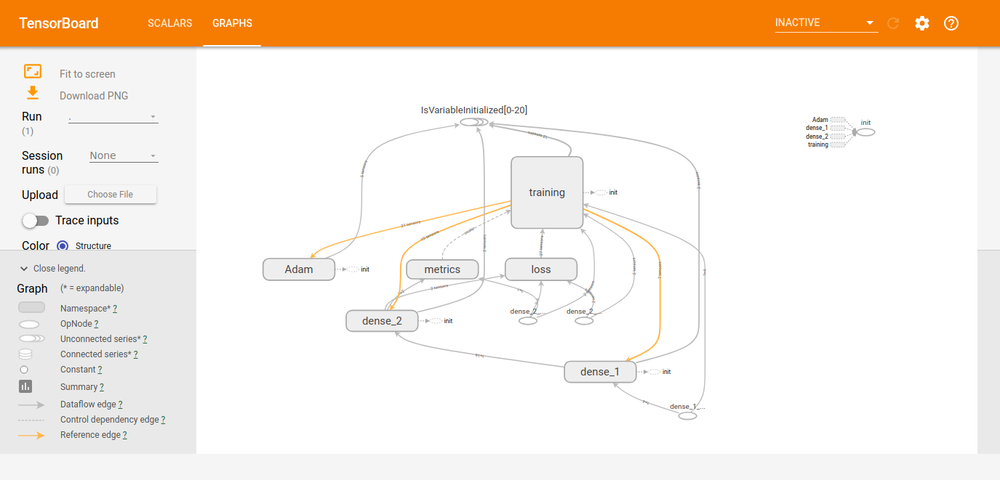

# Priprema za ispit

## Osnovne informacije
Ispit se polaže na računaru i biće dostupna virtuelna mašina sa sistemom Lubuntu 18.04
na kojoj su dostupni alati `Jupyter Notebook` i `Jupyter Lab`.

Kada započnete ispit, na Desktop-u će Vas čekati direktorijum sa oznakom roka u kojem polažete
u kojem će se nalaziti postavke za zadatke.

Na ispitu možete dobiti da rešavate 2 ili 3 zadatka, slična zadacima koji se nalaze u direktorijumima
`jun1` i `jun2` iz prošle školske godine.

Potrebni moduli i funkcije će vam biti unapred upisani u `jupyter` sveske, odnosno svaka
sveska će imati nekoliko ćelija u kojima će biti učitane potrebne stvari iz biblioteka
`keras`, `sklearn`, `numpy` i slično.

Na ispitu će biti dostupna dokumentacija ili u obliku knjiga, ili će biti dozvoljen organičen
pristup internetu na referentne strane za biblioteke koje smo koristili. Više informacija
o ovome će biti objavljeno kasnije nakon dogovora sa računarskom laboratorijom.

Ispit možete polagati u rokovima `JUN1` i `JUN2` **pre** odbrane seminarskog rada.
Više o terminima za odbrane uskoro.

## TensorBoard
Sistem `TensorBoard` se pokreće iz konzole koristeći alat `tensorboard`.
Ukoliko je iz tekućeg direktorijuma dostupan direktorijum `Graphs`, možemo
ukucati sledeće:

```
tensorboard --logdir Graph/

```

Ukoliko je pokretanje uspešno, dočekaće nas poruka slična narednoj:
```
TensorBoard 1.8.0 at http://aurora:6006 (Press CTRL+C to quit)
```

Pokretanjem veb pregledača, sistemu `TensorBoard` može se pristupiti na adresi: `localhost:6006`.



Sistem `TensorBoard` čita informacije iz datoteke `Graph` automatski na svakih 30s. Ideja je omogućiti
korisniku da interaktivno prati obučavanje mreže (koje je vremenski i memorijski često zahtevan proces).

Kako bi se `TensorBoard` koristio sa sistemom `keras`, potrebno je napraviti objekat
koji je instanca klase `TensorBoard` iz modula `keras.callbacks`.

```python
tb = keras.callbacks.TensorBoard(log_dir='./Graph', histogram_freq=0,
                            write_graph=True, write_images=True)
```

Njega je potom potrebno proslediti metodu `fit` nad modelom kao jedan od elemenata liste
koja se prosleđuje imenovanom argumentu `callbacks`.

```python
history = model.fit(X_train, y_train, epochs=epochs, batch_size=batch_size, callbacks=[tb])
```

